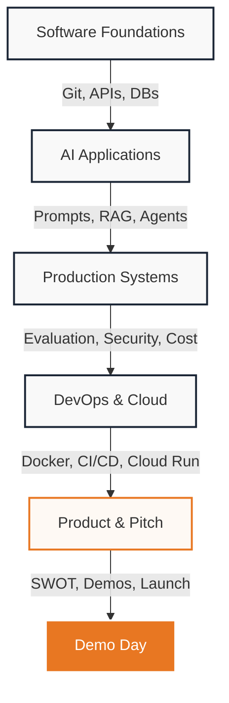

# EJO LABS
## Ejo Labs Summer Training Program 2026
### Academic & Professional Curriculum — 2026 Cohort

**Theme:** *Building the Next Generation of African AI Engineers*  
**Program Duration:** 28 July – 28 August 2026 (5 Weeks)  
**Orientation Day:** Friday, 25 July 2026  
**Closing Ceremony & Demo Day:** Tuesday, 1 September 2026  
**Location:** Kigali, Rwanda & Online (Hybrid)  
**Program Lead:** Bosco Kalinijabo, Lead AI Engineer, Ejo Labs  

---

## 1. Executive Summary

### Why This Program Exists
Artificial Intelligence is reshaping global industries, creating an urgent demand for engineers who can move beyond basic API tutorials and build robust, production-grade systems. The **Ejo Labs Summer Training Program 2026** was established to address this skills gap in Africa. By combining traditional software engineering discipline with advanced agentic workflows and local data sovereignty, this intensive program equips participants to design, build, test, and deploy scalable AI products that solve real-world African challenges.

### Who It Is For
* **University Students:** Computer Science and Engineering students looking to bridge the gap between academic theory and industry expectations.
* **Self-Taught Developers:** Practical programmers who want to formalize their software architecture skills and transition into AI engineering.
* **Tech Enthusiasts & Innovators:** Passionate builders who want to master backend systems, cloud deployment, and large language models (LLMs) to create real-world impact.

### What Students Will Build
Throughout the 5-week program, students work in teams to design and implement a single, continuous, hands-on **Capstone Project**: a production-ready, context-aware AI assistant. This application will leverage:
* A structured **FastAPI** backend in Python.
* A relational **PostgreSQL** database managed via SQLModel.
* A vector-based semantic retrieval system using **Qdrant**.
* Multilingual intelligence using the **EjoChat API** (fine-tuned for Kinyarwanda).
* Secure cloud containerization using **Docker** and deployment via **Google Cloud Run**.

### Teaching Philosophy
We believe in **AI for Everyone**, empowering youth to lead the next wave of technology enthusiasts across Africa. By demystifying artificial intelligence and equipping young minds with practical engineering skills, we cultivate community innovators who not only master modern technology, but actively teach, inspire, and uplift their local communities to build a digitally empowered future.

---

## 2. Program Foundations

### Prerequisites
To ensure a productive learning experience, candidates must meet the following baseline requirements:
* **Technical Equipment:** Access to a personal laptop (Mac, Windows, or Linux) with a minimum of 8GB RAM, and a stable internet connection.
* **Software Literacy:** Familiarity with command-line interfaces (Shell/Terminal) and basic computer literacy.
* **Programming Background:** Prior exposure to basic programming concepts (variables, conditions, loops, functions, lists, and dictionaries) in Python is highly recommended. 
* **Experience Level:** *No prior experience in machine learning, artificial intelligence, cloud computing, or DevOps is required.* We teach these subjects from the ground up.

### Workload & Commitment
This is a highly intensive, fast-paced accelerator. Candidates should expect the following weekly workload:
* **Live Contact Hours:** 4 hours of interactive instruction (2 sessions of 2 hours each, held on Tuesdays and Fridays).
* **Guided Lab Hours:** 3–5 hours of independent programming, debugging, and task execution.
* **Team Collaboration:** 2–3 hours of peer coordination, project alignment, and Git integration.
* **Total Weekly Commitment:** **9–12 hours** of focused effort.

### Code of Conduct
EJO Labs maintains a professional, supportive, and collaborative learning environment. All Fellows are expected to adhere to the following principles:
* **Professional Communication:** Communicate respectfully, constructively, and promptly with instructors, guest lecturers, mentors, and fellow team members.
* **Active Collaboration:** Share responsibilities in team tasks, support peers during debugging, and actively participate in group discussions.
* **Academic & Technical Integrity:** Write original code, document dependencies honestly, and credit templates or references. Outright plagiarism or submitting work built entirely by others without comprehension is ground for dismissal.
* **Punctuality:** Attend sessions on time. If an absence is unavoidable, notify the Program Lead at least 24 hours in advance.

### Mentorship Framework
Fellows are not left to learn in isolation. Our mentorship framework connects participants directly with experienced engineers from Ejo Labs:
* **Daily Office Hours:** Mentors host designated support sessions to assist with complex bugs, environmental issues, and database configurations.
* **Pull Request Reviews:** All weekly lab submissions are pushed to GitHub, where mentors conduct professional code reviews, providing feedback on clean code, optimization, and structure.
* **Architecture Advisory:** Mentors meet with teams weekly to review Capstone Project system diagrams and guide technology choices.
* **Career Mapping:** In the final week, mentors provide one-on-one reviews of CVs, LinkedIn profiles, and GitHub portfolios.

---

## 3. Industry Alignment

The EJO Labs curriculum is co-designed with industry experts to ensure graduates acquire the exact competencies demanded by modern technology firms hiring AI and software engineers.

### Core Industry Competencies Taught:
* **Modern Backend Engineering:** Building asynchronous APIs, handling database migrations, and writing structured schemas using FastAPI and PostgreSQL.
* **Contextual Data Architecture:** Designing document ingestion pipelines, tokenization, semantic chunking, and implementing high-speed vector retrieval with Qdrant.
* **Production Observability & Guardrails:** Tracking costs, monitoring token consumption, setting up LLM tracing with Langfuse, and profiling latency.
* **Enterprise DevOps & Automation:** Containerizing microservices using Docker, orchestrating local dev environments via Docker Compose, and automating tests/deployments through GitHub Actions CI/CD.
* **Data Privacy & Governance:** Designing systems in alignment with national regulations, specifically **Rwanda's Data Protection and Privacy Law**, to ensure local data sovereignty and security.

---

## 4. Assessment & Evaluation Criteria

To receive the **Ejo Labs Summer Training Program Certificate of Completion**, participants are evaluated against a structured criteria framework rather than standard written exams.

| Component | Weight | Description |
| :--- | :---: | :--- |
| **Attendance & Engagement** | **20%** | Punctual attendance in lectures and active contribution to technical discussions. |
| **Weekly Practical Labs** | **20%** | Individual execution and timely submission of the weekly codebase tasks. |
| **Peer & Team Collaboration** | **20%** | Quality of collaboration inside the team, evaluated via peer reviews and Git contribution logs. |
| **Capstone Project Deliverables** | **30%** | Structural completeness, code hygiene, security configuration, and hosting stability of the final product. |
| **Demo Day Presentation** | **10%** | Live demonstration of the capstone, visual polish, and technical responses to the judging panel. |

---

## 5. Week-by-Week Breakdown

### Week 1 — Software Engineering Foundations

#### Session 1: Introduction to AI Engineering & Environment Setup
* **Date:** Tuesday, 28 July 2026
* **Lecturer:** Bosco Kalinijabo
* **Learning Objectives:**
  * Define the role of an AI Engineer and distinguish it from ML Researchers and traditional Software Engineers.
  * Configure a local development environment with VS Code, Python virtual environments, and Git.
  * Demonstrate the use of Git workflows (cloning, branching, committing, pushing, and opening Pull Requests).
* **Topics Covered:**
  * The modern AI Engineering lifecycle: Data, prompt templates, backend logic, APIs, and cloud hosting.
  * Effective integration of AI Coding Assistants (Cursor, Claude Code, Gemini, GitHub Copilot) to accelerate learning without bypassing conceptual foundations.
  * Git and GitHub fundamentals: Branching strategies, atomic commits, pull requests, and peer code reviews.
  * Python refresher for AI application development: Asynchronous execution, type hinting, and virtual environment isolations.
* **Practical Lab:** Setup of the collaborative repository, setting up code formatting (Black/Linter), and pushing the first branch.
* **Session Deliverables:** A shared GitHub repository containing a clean directory structure, configured virtual environment settings, and a successfully merged Pull Request with a basic Python greeting script.

#### Session 2: Introduction to Backend Architecture & API Development
* **Date:** Friday, 31 July 2026
* **Lecturer:** Bosco Kalinijabo
* **Learning Objectives:**
  * Explain the HTTP request-response cycle and REST API design principles.
  * Build a functional backend API with multiple HTTP endpoints using FastAPI.
  * Connect a Python application to a PostgreSQL database using SQLModel.
  * Configure secure application settings using environment variables.
* **Topics Covered:**
  * Backend Fundamentals: HTTP methods (GET, POST, PUT, DELETE), headers, request bodies, and status codes.
  * FastAPI basics: Declarative path parameters, query parameters, validation, and auto-generated Swagger documentation.
  * Relational Database integration: PostgreSQL concepts, tables, relations, and object-relational mapping (ORM) with SQLModel.
  * Configuration security: Preventing key leaks using `.env` files and Pydantic Settings.
* **Practical Lab:** Constructing the REST API interface for the Capstone database.
* **Session Deliverables:** A running FastAPI server connected to a local PostgreSQL instance, containing validated endpoints for object creation and listing, tested via Postman.

---

### Week 2 — Building AI Applications

#### Session 3: Prompt Engineering & Large Language Model (LLM) Fundamentals
* **Date:** Tuesday, 4 August 2026
* **Lecturers:** Bosco Kalinijabo & Dr. Stamp Fabian
* **Learning Objectives:**
  * Explain tokenization, context windows, and model configuration parameters.
  * Design structured, reliable prompt templates using role definition, few-shot learning, and output formatting.
  * Identify, test, and programmatically mitigate model hallucinations.
* **Topics Covered:**
  * Core LLM Mechanics: What is a token? Understanding context windows and how temperature and top-p affect output variance.
  * Advanced Prompt Design: System vs. user prompts, role-prompting, few-shot injection, and structural templates.
  * Output Enforcements: Techniques for forcing LLMs to return reliable machine-readable formats (JSON schemas).
  * Prompt Management: Moving prompt templates out of hardcoded strings into independent YAML/JSON configurations.
* **Practical Lab:** Designing and writing a prompt-testing matrix to process structured text datasets.
* **Session Deliverables:** A prompt template catalog (`prompts.yaml`) with version-controlled prompts configured for classification, summarization, and data extraction, validated across test cases.

#### Session 4: AI Integration & Retrieval-Augmented Generation (RAG)
* **Date:** Friday, 7 August 2026
* **Lecturers:** Ejo Labs Team & Henry
* **Learning Objectives:**
  * Call external LLM APIs asynchronously using Python.
  * Design a document ingestion pipeline (loading, splitting, and embedding).
  * Setup, populate, and query a Qdrant vector database.
  * Integrate domain-specific retrieval data into LLM context prompts.
* **Topics Covered:**
  * Asynchronous HTTP clients in Python and API error handling (exponential backoff).
  * Semantic Data Processing: Document loaders, text splitters, overlap parameters, and embedding models.
  * Vector Indexes: Semantic similarity search, metadata filtering, and configuring Qdrant collections.
  * Kinyarwanda AI Integration: Grounding model context queries using the local EjoChat API.
* **Practical Lab:** Constructing a complete, end-to-end local document query pipeline.
* **Session Deliverables:** A FastAPI endpoint that reads a user question, performs a semantic search against documents indexed in Qdrant, compiles a context-grounded prompt, calls the EjoChat API, and returns a structured response.

---

### Week 3 — Production AI Engineering

#### Session 5: Introduction to AI Agents & Engineering Best Practices
* **Date:** Tuesday, 11 August 2026
* **Lecturers:** Bosco Kalinijabo, Protogene Hahirwabayo & Henry Okonkwo
* **Learning Objectives:**
  * Explain the structural difference between single-prompt scripts and agentic tool-use loops.
  * Implement LLM function calling (tool-use) to execute custom code dynamically.
  * Implement professional logging, centralized configuration, and error-handling routines.
* **Topics Covered:**
  * Agent Architectures: The ReAct (Reasoning and Action) loop, tool declarations, and agent memory.
  * Short-term chat history tracking vs. long-term vector database memory.
  * Human-in-the-loop validation patterns for sensitive or transactional tools.
  * Production Best Practices: CENTRALIZED error catchers, query rate-limiting, and structured JSON logs.
* **Practical Lab:** Equipping the Capstone project with dynamic tools (e.g., calculator, database lookup, date calculations).
* **Session Deliverables:** An active FastAPI agent endpoint that can parse user prompts, select appropriate tools to execute, process tool responses, and return the final answer, supported by detailed runtime logging.

#### Session 6: AI Evaluation & Quality Assurance Basics
* **Date:** Friday, 14 August 2026
* **Lecturers:** Bosco Kalinijabo, Protogene Hahirwabayo & Dr. Stamp Fabian
* **Learning Objectives:**
  * Explain why traditional unit testing is insufficient for stochastic AI responses.
  * Instrument an AI application with telemetry tracing tools to capture user interactions.
  * Design evaluation test suites measuring retrieval precision, context recall, and hallucination rates.
* **Topics Covered:**
  * AI Evaluation Paradigms: Heuristic string matchers vs. semantic embeddings vs. LLM-as-a-judge patterns.
  * Observability Frameworks: Setting up telemetry traces, spans, and execution runs using Langfuse/DeepEval.
  * Performance Analysis: Measuring response latency, parsing efficiency, and calculating cost per query.
* **Practical Lab:** Writing and running evaluation pipelines on Capstone prompt variations.
* **Session Deliverables:** An automated evaluation report mapping the performance of prompt templates against a test dataset, detailing latency metrics, token consumption, and response quality scores.

---

### Week 4 — Security, Deployment & Cost Awareness

#### Session 7: AI Security & Responsible AI
* **Date:** Tuesday, 18 August 2026
* **Lecturers:** Bosco Kalinijabo, Protogene Hahirwabayo & Salma
* **Learning Objectives:**
  * Identify and guard against common AI security risks, including prompt injection and data exposure.
  * Configure API credential security using production-grade key-vault patterns.
  * Apply data sovereignty principles and compliance controls matching local regulatory guidelines.
* **Topics Covered:**
  * AI Vulnerabilities: Direct prompt injection, indirect injection through retrieved documents, and system prompt leakage.
  * Key Protection: Moving from `.env` files to Google Secret Manager, key rotation, and protecting access logs.
  * Regulatory Compliance: Ensuring alignment with **Rwanda's Data Protection and Privacy Law** (data residency, consent, PII scrubbing).
  * Responsible AI: Mitigating demographic bias, handling offensive inputs gracefully, and implementing safety classifiers.
* **Practical Lab:** Attacking a classmate's API to test prompt injection defenses and applying patches.
* **Session Deliverables:** A security assessment report and a patched Capstone repository featuring robust input validation, system prompt guards, and fully encrypted credentials configuration.

#### Session 8: Containerization, Deployment & Cost Optimization
* **Date:** Friday, 21 August 2026
* **Lecturers:** Bosco Kalinijabo, Protogene Hahirwabayo & Neha Fathima
* **Learning Objectives:**
  * Package a Python FastAPI application into a optimized Docker container.
  * Manage local multi-container system dependencies using Docker Compose.
  * Deploy a containerized API to Google Cloud Run.
  * Configure a functional CI/CD pipeline using GitHub Actions.
* **Topics Covered:**
  * Docker Basics: Writing clean `Dockerfiles`, choosing minimal base images, multi-stage builds, and layer caching.
  * Docker Compose: Defining network bridges and environment linkings for FastAPI, PostgreSQL, and Qdrant container nodes.
  * Cloud Serverless: Deploying container instances to Google Cloud Run, setting scaling limits, and configuring custom domains.
  * Automated pipelines: Creating GitHub Action workflows to run linters, execute unit tests, and trigger cloud builds on commit.
  * Cost Engineering: Token compression, caching strategies, and routing logic based on model pricing thresholds.
* **Practical Lab:** Writing container setups and deploying the Capstone project to Google Cloud Run.
* **Session Deliverables:** A running cloud deployment of the Capstone project accessible via a public URL, managed by a GitHub Actions workflow that automates builds on main branch merges.

---

### Week 5 — AI Product Thinking (Joint with High School Track)

#### Session 9: AI Product Design
* **Date:** Tuesday, 25 August 2026
* **Lecturers:** Bosco Kalinijabo & Prof. Dr. Manuel Oriol
* **Learning Objectives:**
  * Analyze user requests to determine if AI is the optimal solution or if traditional software is more appropriate.
  * Map levels of user interface automation relative to potential error impacts.
  * Design user experiences (UX) optimized to handle AI latency and output uncertainty.
* **Topics Covered:**
  * Feasibility Mapping: Assessing if problems are best solved using heuristics, machine learning models, or generative APIs.
  * Interface Patterns for AI: Handling stream interruptions, visual loader animations, user correction controls, and fallback messages.
  * Product Unit Economics: Estimating API operating costs (COGS) and designing sustainable subscription/usage pricing models.
  * AI Safety & Failure Recovery: Handling incorrect model classifications without crashing user sessions.
* **Practical Lab:** Designing product flowcharts, UI mockups, and cost models for the team Capstone project.
* **Session Deliverables:** An AI Product Specification document (1-2 pages) outlining user personas, UI/UX interaction flows, fallback safety policies, and an API operating cost analysis.

#### Session 10: AI Opportunity Discovery & Solution Design
* **Date:** Friday, 28 August 2026
* **Lecturers:** Protogene Hahirwabayo & Dr. Geistanger Andrea
* **Learning Objectives:**
  * Audit institutional or corporate operations to discover and prioritize high-value AI opportunities.
  * Draft comprehensive problem statements and design-thinking outlines for enterprise proposals.
  * Perform a complete SWOT analysis on a proposed AI platform.
* **Topics Covered:**
  * Operational Auditing: Mapping company workflows to find bottleneck points where semantic intelligence applies.
  * SWOT Analysis for AI: Reviewing computational requirements, privacy regulations, talent availability, and market adoption speed.
  * Communication Strategy: How to translate complex code architecture (RAG, agent loops) into business-value proposals for executive buyers.
* **Practical Lab:** Performing a mock enterprise assessment and building a solution pitch.
* **Session Deliverables:** A completed SWOT Analysis worksheet and a 5-slide technical pitch presentation preparing the team for Demo Day.

---

## 6. Capstone Project Requirements

To graduate from the program, every team must produce a fully realized, production-ready AI application. The final submission must include the following assets:

1. **Source Code (GitHub):** A clean, modular repository adhering to industry conventions, featuring an isolated environment configurations, type hints, and code comments.
2. **Technical Documentation (`README.md`):**
   * Detailed deployment and installation instructions.
   * A clean system architecture diagram explaining the data flow between client, API, vector store, and LLMs.
   * Clear API endpoint documentations.
3. **Core AI Integrations:**
   * High-speed semantic search using a local **Qdrant** database instance.
   * Grounding queries using context prompts mapped to the Kinyarwanda-first **EjoChat API**.
   * Output validation routines enforcing structured JSON schema outputs.
4. **DevOps & Cloud Assets:**
   * A functional `Dockerfile` and `docker-compose.yml` for local replicability.
   * A running instance of the application hosted live on **Google Cloud Run**.
   * A GitHub Actions workflow script file (`.github/workflows/deploy.yml`) automating deployment.
5. **Observability & Guardrails:**
   * Configuration logic preventing prompt injection attacks.
   * Telemetry trace files indicating successful integration with Langfuse/DeepEval.
   * Structured, centralized error logs.

---

## 7. Closing Day & Demo Day

* **Date:** Tuesday, 1 September 2026
* **Location:** Kigali Innovation Hub (Hybrid Broadcast)
* **Lead Organizers:** Ejo Labs Team

### Part A — Career Development Workshop (09:00 - 12:00)
Led by Ejo Labs mentors, recruiters, and invited tech industry guests:
* **The AI Engineering Mindset:** Transitioning from tutorials to building resilient software architectures.
* **The Developer Portfolio:** Optimizing a GitHub profile, committing to open source, and structuring code to impress tech recruiters.
* **Technical CV Wording:** How to list RAG, CI/CD, FastAPI, and evaluation metrics to match ATS filters and recruiter criteria.
* **Technical Interview Preparation:** Surviving whiteboarding sessions, system design assessments, and algorithmic screenings.
* **Q&A Panel:** Rwanda's tech landscape and the future demand for local AI developers.

### Part B — Capstone Demo Day (13:30 - 17:30)
The climax of the program:
* **Final Code Freeze & Deployment Audit:** Mentors conduct last-minute stability and performance checks on live endpoints.
* **Technical Pitch Presentations:** Teams deliver a 5-minute slide-and-demo pitch to an audience of tech leaders, university professors, and prospective sponsors.
* **Judging Panel Assessment:** Industry leaders evaluate applications based on architectural robustness, execution quality, and African use-case alignment.
* **Award & Certificate Ceremony:** Presentation of Program Graduation Certificates and awards for outstanding Capstone execution.
* **Networking & Hiring Mixer:** An opportunity for students to connect directly with university delegates, start-up founders, and industry recruiters.
